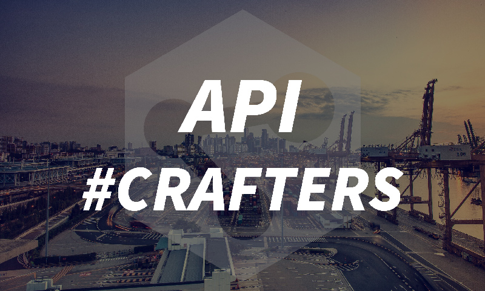

## **WORKSHOP :** Programmation fonctionnelle

Plus qu'une mode, la programmation fonctionnelle présente de réelles atouts dans vos projets de développement logiciel. Ce paradigme permet d'appréhender et de simplifier certaines problématiques qui peuvent parfois s'avérer bien plus compliqué lorsqu'elle sont abordées de manière plus "conventionnelle".

Guider par notre équipe, ce workshop d’une soirée se concentrera sur l'introduction à la programmation fonctionnelle. Accessible, son but sera de vous initier aux bases de cette approche et de vous fournir les premiers éléments vous permettant de comprendre sa logique.

À la fin de cette journée, vous aurez acquis les éléments de base de la programmation fonctionnelle, comprenant les connaissances de base de la théorie, ainsi qu’une maîtrise élémentaire des outils les plus courant.  Idéalement, le but de ce workshop est de vous donner les clés pour débuter la programmation fonctionnelle et d'acquérir les bons réflexes lors de la résolution de problématique de programmation.

Le workshop s'organisera autour de points de théories suivis d'exercices en relation ainsi que de discussions ouvertes sur le sujet. Nous serons présents pour vous accompagné et transmettre nos connaissances et notre expérience sur le sujet.

## Informations supplémentaires :

### Connaissances requises

Connaissances basiques des éléments de programmation: variables, boucles, conditions, tableaux, etc… dans au moins un langage impératif et/ou orienté objet (par exemple Javascript, Java, C, C++, C# …)

### Organisation et matériel

Côté organisationnel et matériel, il vous faut venir avec votre laptop. Nous vous demanderons au préalable d'installer quelques outils permettant de suivre correctement les exercices proposés (des instructions vous parviendront le moment venu).

### Travailler en binôme
Vous aurez la possibilité de travailler en binôme ce jour-là, nous vous demandons simplement de nous prévenir lors de votre inscription (dans le commentaire), si vous êtes accompagné d’une personne (nom + prénom / email).

### Repas - Brown bag session
Une fois n'est pas coutume, lors de cette soirée, il vous est demandé d'amener votre repas que vous pourrez engloutir au moment qui semblera le plus opportun (par exemple durant une des pauses).

## Déroulement de la journée:

  * **18h00** – Accueil
  * **18h10** – Introduction à la programmation fonctionnelle
  * **18h30** – Workshop
  * **21h30** – Fin du workshop

## Inscriptions:

 **Cet événement est ouvert à toutes et à tous et est bien entendu gratuit !
** Pour des raisons d'organisation, nous vous prions de vous inscrire par le biais du formulaire ci-dessous

**Formulaire :** Inscription événement - API Crafters 2.0

Vous n'êtes pas encore membre? <a style="color: white;" href="https://api-ne.ch/devenir-membre/" target="_blank" rel="noopener">Inscrivez-vous ici!</a>

<ul class="cbp-l-project-details-list">
  <li>
    <strong>Événement</strong>Workshop
  </li>
  <li>
    <strong>Où</strong>HUB Neuchâtel
  </li>
  <li>
    <strong>Date</strong>Jeudi 18 juillet 2019
  </li>
  <li>
    <strong>Heure</strong>Dès 18h00
  </li>
  <li>
    <strong>Lieu</strong>Rue des Terreaux 7, Neuchâtel
  </li>
</ul>
