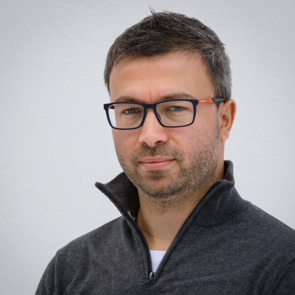

## **API DevTalks**

Durant ces quelques conférences, les entreprises et les compétences de la région seront mises à l'honneur.
Venez découvrir comment PinDex nous propose de revisiter notre région, l'expertise de chronométrage sportif de SwissTiming ainsi qu'une introduction au domaine de la crypto-finance avec Bity.

Dans un second temps, Sedat Adiyaman nous parlera entreprenariat et innovation collaborative alors que Sammy Ramareddy nous introduira au Big Data et sa plateforme basée sur Kubernetes chez Swisscom.

Une excellente occasion d'échanger en tant que professionnels, futurs-professionnels ou passionnés du domaine de l'informatique et des nouvelles technologies.

## Programme de la Soirée

  

    

      <h2>
        <strong>18H15: </strong>Accueil - mot de bienvenue
      </h2>
    

  

## **18H25:** Présentation d'entreprise

Pindex

Pindex est une application pour smartphones permettant de trouver des activités et des événements à faire dans notre région selon vos envies et centres d’intérêts. Une équipe d’étudiants en informatique, mathématiques ou encore marketing travaille bénévolement sur ce projet avec en ligne de mire la volonté de redorer le blason de notre belle région !

Étudiant en Mathématiques et en Finances à l’Université de Neuchâtel, je suis co-fondateur du projet Pindex, avec Timothé Duran et Xavier Pantet. Tous les trois, nous avons voulu créer Pindex afin de démontrer les richesses de notre région, que ce soit en terme de connaissances technologiques tout comme en termes de culture ou de loisirs. En ce qui me concerne, je m’occupe des finances de l’entreprise, ainsi que des secteurs Communication et Marketing de Pindex.

## **18H45:** Présentation d'entreprise

Swiss Timing

Derrière chaque record, il y a des années d'entraînement et de dépassement de soi de la part d'un athlète. Derrière le résultat, il y a le savoir-faire, la technologie de pointe et la précision de Swiss Timing.

Société du SwatchGroup basé à Corgémont, comprenant 165 collaborateurs, nous livrons des solutions complètes de chronométrage pour les évènements sportifs internationaux de grande envergure tel que les Jeux Olympiques.

## **19H05:** Présentation d'entreprise

Bity

Bity SA, passerelle entre le monde traditionnel de la finance et celui de la crypto-finance.

Société suisse, Bity SA est une plateforme réglementée d’achat, de vente et d’échange de crypto-monnaies. Elle s’appuie sur des technologies de pointe pour fournir des services financiers fiables et sécurisés pour les particuliers et les entreprises.

  

    

      <h2>
        <strong>19H20: </strong>Pause
      </h2>
    

  

## **19H40:** Conférence théorique - Innover de manière collaborative

Think2make

Sedat Adiyaman est le fondateur de la manufacture d'idées <a href="http://think2make.ch/" target="_blank" rel="noopener">think2make.ch</a>, une société d'innovation basée à Neuchâtel. Il est intervenu dans plus de 100 projets où il accompagne des entrepreneurs à mettre de nouvelles idées sur le marché.

Un vrai passionné de l'innovation et de l'entrepreneuriat, Sedat a fondé et dirige <a href="https://coworking-neuchatel.ch/" target="_blank" rel="noopener">Coworking Neuchâtel sàrl</a>, le premier et le meilleur espace+communauté de travail pour les entrepreneurs et indépendants à Neuchâtel, depuis 2014.

Il est également auteur : <a href="http://lelivrefaire.com" target="_blank" rel="noopener">faire : comment innover de façon collaborative</a>, éditions Greyscale press - 2017. Dont il présentera le contenu de la méthode faire et son expérience d'auteur durant cette conférence. Il sera possible d'acheter le livre dédicacé après la présentation.

## **20H30:** Conférence technique - Big Data avec Kubernetes

Swisscom

Swisscom développe et exploite différentes solutions pour monitorer son réseau, dans le but d’améliorer sa fiabilité et optimiser son fonctionnement.

Afin de donner aux équipes de Data Science les moyens de se concentrer sur le développement de Data Pipelines, une plateforme “Kafka as a Service” permettant de gérer plusieurs aspects autour de l’analyse de données (acquisition, transformation, gouvernance, sécurité) a été développée.

Dans cette session, nous allons présenter comment nous avons construit cette plateforme - Swisscom Firehose - ainsi que la manière dont nous utilisons Kubernetes comme base pour notre nouvelle plateforme Big Data & AI.

## **21H15:** Apéritif et fin

## Speakers:

  

  

  

  

  

### Jérémy Colombo

Co-fondateur du projet  <a href="https://www.pindex.ch/" target="_blank" rel="noopener">Pindex</a>

  

  

  

  

  

  

### Joseph Ferry

Software Department Manager  <a href="https://www.swisstiming.com/" target="_blank" rel="noopener">Swiss Timing</a>

  

  

  

  

  

  

### Florian Vessaz

Full Stack Engineer  <a href="https://bity.com/" target="_blank" rel="noopener">Bity</a>

  

  

 

  

  

  

  

  

  

### Sedat Adiyaman

CEO  <a href="http://think2make.ch/" target="_blank" rel="noopener">think2make.ch</a>  <a href="https://coworking-neuchatel.ch/" target="_blank" rel="noopener">coworking-neuchatel.ch</a>

  

  

  

  

  

  

### Sammy Ramareddy

Senior Technical Product Owner  <a href="https://www.swisscom.ch/" target="_blank" rel="noopener">Swisscom Data, Analytics & AI Group</a>

  

  

  

  

  

  

  

  

  

## Inscriptions:

 Cet événement est bien évidemment gratuit et ouvert à tous, mais pour des questions d'organisation, nécessite une inscription!
**N'oubliez pas d'en parler autour de vous!**

<ul class="cbp-l-project-details-list">
  <li>
    <strong>Événement</strong>Conférences
  </li>
  <li>
    <strong>Où</strong>Bleu Café
  </li>
  <li>
    <strong>Date</strong>Jeudi 27 septembre 2018
  </li>
  <li>
    <strong>Heure</strong>Dès 18H15
  </li>
  <li>
    <strong>Lieu</strong>Faubourg du Lac 27, Neuchâtel
  </li>
</ul>

[Voir l'emplacement sur Google Maps](https://www.google.com/maps/search/?api=1&query=Faubourg du Lac 27, 2000 Neuchâtel)
