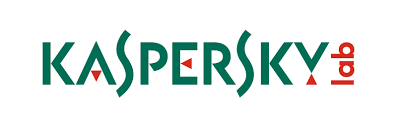

## **KIPS GAME - Workshop:** Kaspersky Lab

Kaspersky Interactive Protection Simulation (KIPS) est un exercice qui place des équipes au sein d'un environnement commercial simulé. Ces équipes devront faire face à une série de cybermenaces inattendues, tout en essayant d'optimiser les bénéfices et d'entretenir la confiance.

L'idée est de construire une stratégie de défense informatique en effectuant des choix parmi les meilleures commandes proactives et réactives disponibles. Chaque réaction des équipes face aux événements modifie la façon dont le scénario se déroule et impacte, en définitive, les bénéfices générés par l'entreprise… de façon positive ou négative.

  <a href="https://media.kaspersky.com/fr/Kaspersky-Interactive-Protection-Simulation.pdf" target="_blank" rel="noopener">   Informations sur le jeu</a>

## Informations supplémentaires :

### Connaissances requises
 Le jeu s’adresse à toutes personnes intéressées ou impactées de près ou de loin aux problématiques rencontrées dans le domaine de l'IT. Le niveau de connaissance n’a pas besoin d’être élevé, les concepts de base suffisent.

### Organisation et matériel
 Nous vous fournirons le matériel nécessaire (Table de jeu, tablettes, etc… ) afin de faire face aux différentes situations du jeu. N’ayez pas peur, vous serez par groupe de 3 à 5 personnes selon le succès de la soirée.

### Invitations
Afin de rendre l’expérience encore plus conviviale, vous avez la possibilité d’inviter jusqu’à 4 personnes afin de constituer votre groupe (**ces personnes ne sont pas obligées d’être membres de l’association**). Demandez à vos collègues et/ou connaissances de vous accompagner!

Nous vous demandons cependant de nous envoyer la liste de vos invités (Nom / Prénom /E-mail)  avant l’événement à l'adresse suivante : <a href="mailto:helloworld@api-ne.ch" target="_blank" rel="noopener">helloworld@api-ne.ch</a>

## Déroulement :

  * **18H45 : **Accueil des participants
  * **19H00:** KIPS GAME (Durée : environ 2 heures)
  * **Suite:** Apéritif et disposition du comité de direction pour vos questions et remarques générales

## Inscriptions:

 **Cet événement est réservé aux membres.** Nous vous prions de bien vouloir vous acquitter de votre cotisation annuelle (min. CHF 50.-) pour l'année 2018 avant l'événement. (Possibilité de payer sur place le 30 janvier)

_Pour les étudiants, nous vous demandons d'envoyer votre attestation d'études (photo de la carte d'étudiant acceptée) à l'adresse suivante : <a href="mailto:helloworld@api-ne.ch" target="_blank" rel="noopener">helloworld@api-ne.ch</a>._

    En tant que membre de l'API, vous pouvez inviter jusqu’à 4 personnes gratuitement.
<em> Section "invitations" en dessus.</em>

## Inscription obligatoire:

Cette inscription n'est plus disponible.

Vous n'êtes pas encore membre? <a style="color: white;" href="https://api-ne.ch/devenir-membre/" target="_blank" rel="noopener">Inscrivez-vous ici!</a>

<ul class="cbp-l-project-details-list">
  <li>
    <strong>Événement</strong> Game / Workshop
  </li>
  <li>
    <strong>Où</strong>Aula du CIFOM-ET
  </li>
  <li>
    <strong>Date</strong>Mardi 30 janvier 2018
  </li>
  <li>
    <strong>Heure</strong>Dès 18H45
  </li>
  <li>
    <strong>Lieu</strong>2ème étage, Rue Klaus 1, au Locle
  </li>
</ul>

[Voir l'emplacement sur Google Maps](https://www.google.com/maps/search/?api=1&query=Klaus 1, 2400 Le Locle)
